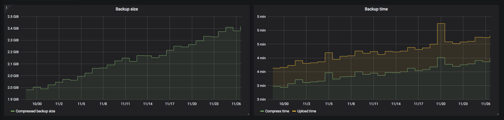
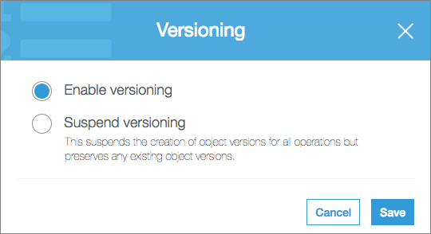
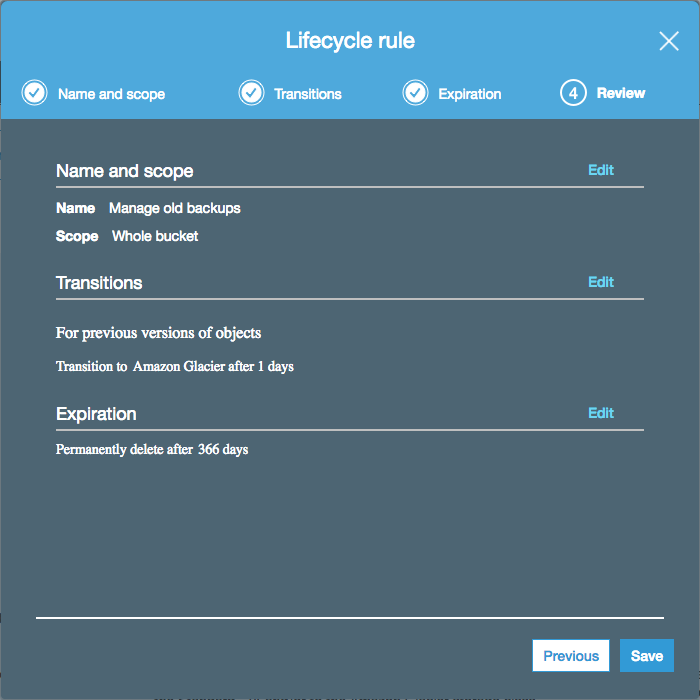
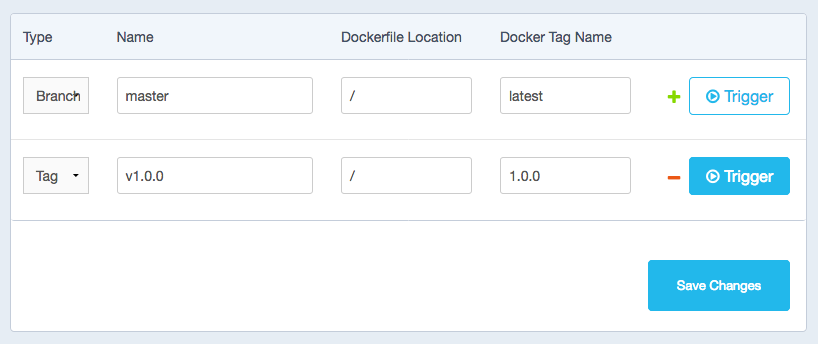

# docker-volume-backup

Docker image for performing simple backups of Docker volumes. Main features:

- Mount volumes into the container, and they'll get backed up
- Use full `cron` expressions for scheduling the backups
- Backs up to local disk, [AWS S3](https://aws.amazon.com/s3/), or both
- Allows triggering a backup manually if needed
- Optionally stops containers for the duration of the backup, and starts them again afterward, to ensure consistent backups
- Optionally `docker exec`s commands before/after backing up a container, to allow easy integration with database backup tools, for example
- Optionally ships backup metrics to [InfluxDB](https://docs.influxdata.com/influxdb/), for monitoring
- Optionally encrypts backups with `gpg` before uploading

## Examples

### Backing up locally

Say you're running some dashboards with [Grafana](https://grafana.com/) and want to back them up:

```yml
version: "3"

services:

  dashboard:
    image: grafana/grafana:7.4.5
    volumes:
      - grafana-data:/var/lib/grafana           # This is where Grafana keeps its data

  backup:
    image: futurice/docker-volume-backup
    volumes:
      - grafana-data:/backup/grafana-data:ro    # Mount the Grafana data volume (as read-only)
      - ./backups:/archive                      # Mount a local folder as the backup archive

volumes:
  grafana-data:
```

This will back up the Grafana data volume, once per day, and write it to `./backups` with a filename like `backup-2018-11-27T16-51-56.tar.gz`.

### Backing up to S3

Off-site backups are better, though:

```yml
version: "3"

services:

  dashboard:
    image: grafana/grafana:7.4.5
    volumes:
      - grafana-data:/var/lib/grafana           # This is where Grafana keeps its data

  backup:
    image: futurice/docker-volume-backup
    environment:
      AWS_S3_BUCKET_NAME: my-backup-bucket      # S3 bucket which you own, and already exists
      AWS_ACCESS_KEY_ID: ${AWS_ACCESS_KEY_ID}   # Read AWS secrets from environment (or a .env file)
      AWS_SECRET_ACCESS_KEY: ${AWS_SECRET_ACCESS_KEY}
    volumes:
      - grafana-data:/backup/grafana-data:ro    # Mount the Grafana data volume (as read-only)

volumes:
  grafana-data:
```

This configuration will back up to AWS S3 instead. See below for additional tips about [S3 Bucket setup](#s3-bucket-setup).

### Restoring from S3

Downloading backups from S3 can be done however you usually interact with S3, e.g. via the `aws s3` CLI or the AWS Web Console.

However, if you're on the host that's running this image, you can also download the latest backup with:

```
$ docker-compose exec -T backup bash -c 'aws s3 cp s3://$AWS_S3_BUCKET_NAME/$BACKUP_FILENAME -' > restore.tar.gz
```

From here on out the restore process will depend on a variety of things, like whether you've encrypted the backups, how your volumes are configured, and what application it is exactly that you're restoring.

But for the sake of example, to finish the restore for the above Grafana setup, you would:

1. Extract the contents of the backup, with e.g. `tar -xf restore.tar.gz`. This would leave you with a new directory called `backup` in the current dir.
1. Figure out the mount point of the `grafana-data` volume, with e.g. `docker volume ls` and then `docker volume inspect`. Let's say it ends up being `/var/lib/docker/volumes/bla-bla/_data`. This is where your live Grafana keeps its data on the host file system.
1. Stop Grafana, with `docker-compose stop dashboard`.
1. Move any existing data aside, with e.g. `sudo mv /var/lib/docker/volumes/bla-bla/_data{,_replaced_during_restore}`. You can also just remove it, if you like to live dangerously.
1. Move the backed up data to where the live Grafana can find it, with e.g. `sudo cp -r backup/grafana-data /var/lib/docker/volumes/bla-bla/_data`.
1. Depending on the Grafana version, [you may need to set some permissions manually](http://docs.grafana.org/installation/docker/#migration-from-a-previous-version-of-the-docker-container-to-5-1-or-later), e.g. `sudo chown -R 472:472 /var/lib/docker/volumes/bla-bla/_data`.
1. Start Grafana back up, with `docker-compose start dashboard`. Your Grafana instance should now have travelled back in time to its latest backup.

### Triggering a backup manually

Sometimes it's useful to trigger a backup manually, e.g. right before making some big changes.

This is as simple as:

```
$ docker-compose exec backup ./backup.sh

[INFO] Backup starting

8 containers running on host in total
1 containers marked to be stopped during backup

...
...
...

[INFO] Backup finished

Will wait for next scheduled backup
```

If you **only** want to back up manually (i.e. not on a schedule), you should either:

1. Run the image without `docker-compose`, override the image entrypoint to `/root/backup.sh`, and ensure you match your env-vars with what the default `src/entrypoint.sh` would normally set up for you, or
1. Just use `BACKUP_CRON_EXPRESSION="#"` (to ensure scheduled backup never runs) and execute `docker-compose exec backup ./backup.sh` whenever you want to run a backup

### Stopping containers while backing up

It's not generally safe to read files to which other processes might be writing. You may end up with corrupted copies.

You can give the backup container access to the Docker socket, and label any containers that need to be stopped while the backup runs:

```yml
version: "3"

services:

  dashboard:
    image: grafana/grafana:7.4.5
    volumes:
      - grafana-data:/var/lib/grafana           # This is where Grafana keeps its data
    labels:
      # Adding this label means this container should be stopped while it's being backed up:
      - "docker-volume-backup.stop-during-backup=true"

  backup:
    image: futurice/docker-volume-backup:2.0.0
    environment:
      AWS_S3_BUCKET_NAME: my-backup-bucket      # S3 bucket which you own, and already exists
      AWS_ACCESS_KEY_ID: ${AWS_ACCESS_KEY_ID}   # Read AWS secrets from environment (or a .env file)
      AWS_SECRET_ACCESS_KEY: ${AWS_SECRET_ACCESS_KEY}
    volumes:
      - /var/run/docker.sock:/var/run/docker.sock:ro # Allow use of the "stop-during-backup" feature
      - grafana-data:/backup/grafana-data:ro    # Mount the Grafana data volume (as read-only)

volumes:
  grafana-data:
```

This configuration allows you to safely back up things like databases, if you can tolerate a bit of downtime.

### Pre/post backup exec

If you don't want to stop the container while it's being backed up, and the container comes with a backup utility (this is true for most databases), you can label the container with commands to run before/after backing it up:

```yml
version: "3"

services:

  database:
    image: influxdb:1.5.4
    volumes:
      - influxdb-data:/var/lib/influxdb         # This is where InfluxDB keeps its data
      - influxdb-temp:/tmp/influxdb             # This is our temp space for the backup
    labels:
      # These commands will be exec'd (in the same container) before/after the backup starts:
      - docker-volume-backup.exec-pre-backup=influxd backup -portable /tmp/influxdb
      - docker-volume-backup.exec-post-backup=rm -rfv /tmp/influxdb

  backup:
    image: futurice/docker-volume-backup:2.0.0
    volumes:
      - /var/run/docker.sock:/var/run/docker.sock:ro # Allow use of the "pre/post exec" feature
      - influxdb-temp:/backup/influxdb:ro       # Mount the temp space so it gets backed up
      - ./backups:/archive                      # Mount a local folder as the backup archive

volumes:
  influxdb-data:
  influxdb-temp:
```

The above configuration will perform a `docker exec` for the database container with `influxd backup`, right before the backup runs. The resulting DB snapshot is written to a temp volume (`influxdb-temp`), which is then backed up. Note that the main InfluxDB data volume (`influxdb-data`) isn't used at all, as it'd be unsafe to read while the DB process is running.

Similarly, after the temp volume has been backed up, it's cleaned up with another `docker exec` in the database container, this time just invoking `rm`.

If you need a more complex script for pre/post exec, consider mounting and invoking a shell script instead.

## Configuration

Variable | Default | Notes
--- | --- | ---
`BACKUP_SOURCES` | `/backup` | Where to read data from. This can be a space-separated list if you need to back up multiple paths, when mounting multiple volumes for example. On the other hand, you can also just mount multiple volumes under `/backup` to have all of them backed up.
`BACKUP_CRON_EXPRESSION` | `@daily` | Standard debian-flavored `cron` expression for when the backup should run. Use e.g. `0 4 * * *` to back up at 4 AM every night. See the [man page](http://man7.org/linux/man-pages/man8/cron.8.html) or [crontab.guru](https://crontab.guru/) for more.
`BACKUP_FILENAME` | `backup-%Y-%m-%dT%H-%M-%S.tar.gz` | File name template for the backup file. Is passed through `date` for formatting. See the [man page](http://man7.org/linux/man-pages/man1/date.1.html) for more.
`BACKUP_ARCHIVE` | `/archive` | When this path is available within the container (i.e. you've mounted a Docker volume there), a finished backup file will get archived there after each run.
`BACKUP_UID` | `root (0)` | After backup file has been moved to archive location the file user ownership is changed to this UID.
`BACKUP_GID` | `$BACKUP_UID` | After backup file has been moved to archive location the file group ownership is changed to this GID.
`BACKUP_WAIT_SECONDS` | `0` | The backup script will sleep this many seconds between re-starting stopped containers, and proceeding with archiving/uploading the backup. This can be useful if you don't want the load/network spike of a large upload immediately after the load/network spike of container startup.
`BACKUP_HOSTNAME` | `$(hostname)` | Name of the host (i.e. Docker container) in which the backup runs. Mostly useful if you want a specific hostname to be associated with backup metrics (see InfluxDB support).
`BACKUP_CUSTOM_LABEL` |  | When provided, the [start/stop](#stopping-containers-while-backing-up) and [pre/post exec](#prepost-backup-exec) logic only applies to containers with this custom label.
`ROTATE_BACKUPS` |  | Set to `true` in order to make use of integrated package [rotate-backups](https://github.com/xolox/python-rotate-backups). The package  preserves a defined set of essential backups and eliminates redundant backups.
`AWS_S3_BUCKET_NAME` |  | When provided, the resulting backup file will be uploaded to this S3 bucket after the backup has ran.
`AWS_GLACIER_VAULT_NAME` |  | When provided, the resulting backup file will be uploaded to this AWS Glacier vault after the backup has ran.
`AWS_ACCESS_KEY_ID` |  | Required when using `AWS_S3_BUCKET_NAME`.
`AWS_SECRET_ACCESS_KEY` |  | Required when using `AWS_S3_BUCKET_NAME`.
`AWS_DEFAULT_REGION` |  | Optional when using `AWS_S3_BUCKET_NAME`. Allows you to override the AWS CLI default region. Usually not needed.
`AWS_EXTRA_ARGS` |  | Optional additional args for the AWS CLI. Useful for e.g. providing `--endpoint-url <url>` for S3-interopable systems, such as DigitalOcean Storage.
`GPG_PASSPHRASE` |  | When provided, the backup will be encrypted with gpg using this `passphrase`.
`INFLUXDB_URL` |  | When provided, backup metrics will be sent to an InfluxDB instance at this URL, e.g. `https://influxdb.example.com`.
`INFLUXDB_DB` |  | Required when using `INFLUXDB_URL`; e.g. `my_database`.
`INFLUXDB_CREDENTIALS` |  | Required when using `INFLUXDB_URL`; e.g. `user:pass`.
`INFLUXDB_MEASUREMENT` | `docker_volume_backup` | Required when using `INFLUXDB_URL`.
`TZ` | `UTC` | Which timezone should `cron` use, e.g. `America/New_York` or `Europe/Warsaw`. See [full list of available time zones](http://manpages.ubuntu.com/manpages/bionic/man3/DateTime::TimeZone::Catalog.3pm.html).

## Metrics

After the backup, the script will collect some metrics from the run. By default, they're just written out as logs. For example:

```
docker_volume_backup
host=my-demo-host
size_compressed_bytes=219984
containers_total=4
containers_stopped=1
time_wall=61.6939337253571
time_total=1.69393372535706
time_compress=0.171068429946899
time_upload=0.56016993522644
```

If so configured, they can also be shipped to an InfluxDB instance. This allows you to set up monitoring and/or alerts for them. Here's a sample visualization on Grafana:



## Automatic backup rotation

You probably don't want to keep all backups forever. A more common strategy is to hold onto a few recent ones, and remove older ones as they become irrelevant. There's a built-in support for this in `docker-volume-backup` provided by [rotate-backups](https://github.com/xolox/python-rotate-backups).

### Rotation for local backups

Set the environmental variable `ROTATE_BACKUPS: "true"` for the backup container.
The default configuration preserves seven daily, four weekly, twelve monthly and unlimited yearly backups:
```
[/archive]
daily = 7
weekly = 4
monthly = 12
yearly = always
ionice = idle
```
You are free to provide a custom plan by mounting an own .rotate-backups.ini by mounting one in the backup container:
```
volumes:
  - .rotate-backups.ini:/config/.rotate-backups.ini
```
In order to test your custom plan, set `ROTATE_BACKUPS: "dry-run"` and see the result in the container logs when the backup routine has been triggered (either by cron or by [executing backup.sh manually](#triggering-a-backup-manually)).

### Rotation for S3 backups

Amazon S3 has [Versioning](https://docs.aws.amazon.com/AmazonS3/latest/dev/Versioning.html) and [Object Lifecycle Management](https://docs.aws.amazon.com/AmazonS3/latest/dev/object-lifecycle-mgmt.html) features that can be useful for backups.

First, you can enable versioning for your backup bucket:



Then, you can change your backup filename to a static one, for example:

```yml
environment:
  BACKUP_FILENAME: latest.tar.gz
```

This allows you to retain previous versions of the backup file, but the _most recent_ version is always available with the same filename:

    $ aws s3 cp s3://my-backup-bucket/latest.tar.gz .
    download: s3://my-backup-bucket/latest.tar.gz to ./latest.tar.gz

To make sure your bucket doesn't continue to grow indefinitely, you can enable some lifecycle rules:



These rules will:

- Move non-latest backups to a cheaper, long-term storage class ([Glacier](https://aws.amazon.com/glacier/))
- Permanently remove backups after a year
- Still always keep the latest backup available (even after a year has passed)

## Testing

A bunch of test cases exist under [`test`](test/). To run them:

    cd test/backing-up-locally/
    docker-compose stop && docker-compose rm -f && docker-compose build && docker-compose up

Some cases may need secrets available in the environment, e.g. for S3 uploads to work.

## Building

New images can be conveniently built on [Docker Hub](https://hub.docker.com/r/futurice/docker-volume-backup/~/settings/automated-builds/). Update the tag name, save, and use the "Trigger" button:



If this won't work, local build & push should:

```
docker build -t futurice/docker-volume-backup:2.1.0 .
docker push futurice/docker-volume-backup:2.1.0
```
